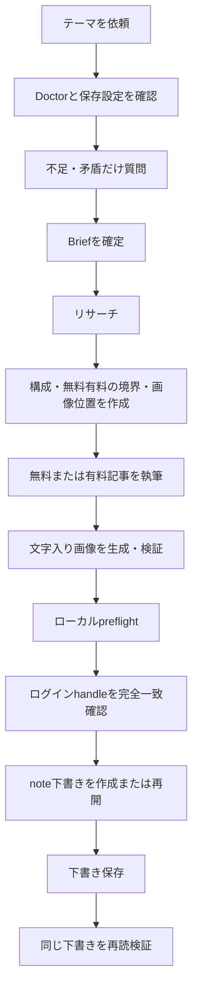

# Note Draft Pipeline

Codex、Claude Code、NousResearch Hermes Agentで使える、note記事制作のためのAgent Skillです。

初回利用時にユーザー専用の「note生成くん」を育成し、その後は次の流れを一貫して実行します。

```text
ヒアリング
→ 文体学習
→ 必要なら画像の「相棒」を登録
→ リサーチ
→ 記事構成
→ 無料／有料部分の設計
→ 本文執筆
→ 文字入り画像生成
→ noteへ自動入力
→ 下書き保存
→ 同じ下書きを再読して検証
```

GitHubリポジトリ:

<https://github.com/Azamarusuisan/AZMAEUni>

図解付きの導入・運用マニュアル: <https://azamarusuisan.github.io/AZMAEUni/>

## 重要事項

- noteには本Skillが利用できる公式投稿APIがないため、ChromeまたはSafariを操作します。
- Gitからインストールしただけでは、ヒアリング画面は自動表示されません。最初のnote作成依頼で育成が始まります。
- 対象は選択したブラウザで現在ログイン中のnoteアカウントだけです。
- `Azamarusuisan`はGitHub上の配布者名だけです。配布物に販売者のnote handle、Googleアカウント、メール、Chromeプロファイルは含めません。
- 購入者ごと・PCごとに空のワークスペースから開始し、その人が選んだブラウザセッションだけを確認します。別ユーザーの確認済みhandleを流用しません。
- 画像へ継続して登場させるマスコット／キャラクターの有無を初回に必ず質問します。基準画像は各購入者のワークスペースだけに保存し、配布者や別ユーザーのキャラクターを混ぜません。
- パスワード、Cookie、MFAコード、セッショントークンは保存しません。
- 無料記事だけでなく、有料記事の無料部分・有料部分・価格案・有料ライン案まで作れます。
- 公開、予約投稿、販売開始、アカウント自動切替は行いません。価格と有料ラインのCMS設定は、記事ごとの本人確認なしに操作しません。
- 最終地点は「下書き保存と再読検証」です。公開ボタンは操作しません。
- ブラウザや画像生成能力が利用できない場合、noteを変更する前に安全停止します。
- Windowsは**Google Chrome経路だけ**を使用し、Safariへfallbackしません。
- Windows購入者は記事作成前に`windows-doctor.ps1`を実行します。ローカル診断で判定できないChrome接続・画像生成・ブラウザファイル送信は、Agent会話内で別々に確認します。

## インストール後にできること

| 機能 | 内容 |
|---|---|
| 初回育成 | 発信目的、読者、文体、調査、画像、CTAなどをヒアリング |
| 自分の画像の相棒 | マスコット／キャラクターがいるかを初回に確認。いる場合は承認済み基準画像と変えてはいけない特徴を固定し、記事ごとの登場位置まで検証 |
| noteアカウント確認 | ログイン中のcanonical handleを確認して保存 |
| 文体学習 | 本人が執筆した記事だけを読み、Writing Profileを作成 |
| 差分ヒアリング | 保存済み設定を再質問せず、未解決・矛盾・高リスク項目だけ質問 |
| URLからリサーチ | 渡されたHTTPS URLを実際に開き、要点・日付・出典を記事へ紐づけ。開けないURLは未読として報告 |
| マルチプラットフォーム調査 | 官公庁、統計、論文、企業IR、技術文書に加え、日本のnote、英語圏のReddit、Baiduを入口にした中国語圏から、問いに合う調査先を選択 |
| 構成作成 | タイトル、見出し、画像位置、引用位置を本文より先に決定 |
| 本文執筆 | 読みやすさ、SEO、AIO、読了率、SNS共有を考慮 |
| 有料記事 | 無料部分で購入判断材料を示し、有料部分へ手順・実例・テンプレート・チェックリストを配置。価格案と有料ライン案も作成 |
| 画像生成 | サムネイル、記事内画像、図解、比較図、フロー図を生成 |
| 文字入り画像 | サムネイルと本文画像の確定文言を記録し、最終ファイル上で一字ずつ照合 |
| note入力 | タイトル、本文、見出し、リンク、画像、サムネイル、本文内ハッシュタグを設定 |
| 下書き保存 | 公開せず、同じ下書きを再読して保存結果を確認 |
| 再開 | 保存済みDraftRefを使い、重複下書きを作らず途中から再開 |
| エラー報告 | 失敗箇所、原因、再試行方法、手動操作方法、ローカル成果物を表示 |
| アイキャッチ正規化 | noteサムネイルを `1280x670` へ正規化し、寸法・文字・コントラストを実ファイルで検査 |
| 定期実行 | cadenceを保存し、scheduler中立の短いpromptを生成。無人実行は下書きまで |
| Brain記事（手動運用） | 無料／有料の記事と `1280x670` 画像、価格・紹介率・有料ライン案を作成。Brainへの転記と販売設定、下書き保存は人が操作 |

## 対応環境

### Agent

| Agent | 画像 | Chrome | Safari |
|---|---|---|---|
| OpenAI Codex | `imagegen` Skill | ChatGPT Chrome Plugin | Computer Use Plugin（macOS） |
| Anthropic Claude Code | 接続済み画像生成Skill/MCP | Claude in Chrome | semantic Computer Use MCP（macOS） |
| NousResearch Hermes Agent | `image_generate` | `/browser connect` | `computer_use` + `cua-driver`（macOS） |

「Hermes Agent」は `NousResearch/hermes-agent` を指します。同名の別製品は対象外です。

### 共通要件

- Python 3.10以降
- Web検索またはブラウジング能力
- 対応する画像生成能力
- ChromeまたはmacOS上のSafari操作能力
- 利用者が手動ログインできるnoteアカウント

本リポジトリはブラウザ拡張、画像プロバイダー、macOS権限、各AgentのToolをインストールしません。実行前のDoctorが現在のセッションで利用可能か確認します。

### Windows

| 環境 | 対応 |
|---|---|
| Windows 11（最新更新） | 推奨。Native PowerShell + Google Chrome |
| Windows 10 build 17763以降 | best effort。完全更新が必要 |
| PowerShell | Windows PowerShell 5.1／PowerShell 7 |
| Python | 3.10〜3.14を自動検出 |
| WSL2 | Linux手順として対応。Native Windowsとパスを混ぜない |
| WSL1 | 非対応 |
| ARM64／会社管理PC | Agent・Chrome・Policyを実機Doctorで確認 |

詳しい対応表とエラー別の直し方は[Windows support and recovery](references/windows.md)を参照してください。

## インストール

### CodexへGitHub URLから入れる

Codexでは、この公開リポジトリをskills-only Pluginとして追加できます。
GitHubへのログインは不要です。次のURLを含む2コマンドを実行します。
macOS、Windows PowerShell、WSL2でコマンドは共通です。

```bash
codex plugin marketplace add https://github.com/Azamarusuisan/AZMAEUni.git
codex plugin add write-note-drafts@azmaeuni
```

Codexアプリを再起動し、新しいチャットで次のように依頼します。

```text
$write-note-drafts を使ってnoteを書いて
```

marketplace側でバージョン`v0.3.6`へ固定するため、開発途中の変更が購入者環境へ
突然入ることはありません。更新版へ切り替えるときだけ、配布側が検証済みrelease
tagを更新します。
GitHub URLへPersonal Access Tokenを埋め込まないでください。

Claude CodeまたはHermesでも同じcheckoutを共有したい場合は、以下のclone方式を
使用します。

### 1. 共通ディレクトリへcloneする

Codex、Claude Code、Hermes Agentで同じcheckoutを共有できます。公開URLを
`git clone`するため、GitHubアカウント、Personal Access Token、販売者アカウントへの
ログインは不要です。

```bash
mkdir -p "$HOME/.agents/skills"
git clone https://github.com/Azamarusuisan/AZMAEUni.git "$HOME/.agents/skills/write-note-drafts"
```

Windows PowerShell:

```powershell
New-Item -ItemType Directory -Force "$env:USERPROFILE\.agents\skills" | Out-Null
git clone https://github.com/Azamarusuisan/AZMAEUni.git "$env:USERPROFILE\.agents\skills\write-note-drafts"
Set-Location "$env:USERPROFILE\.agents\skills\write-note-drafts"
powershell.exe -NoProfile -ExecutionPolicy Bypass `
  -File .\scripts\windows-doctor.ps1 -Agent codex -Target note
```

Windowsでは`py -3.11`のように版を固定せず、以後の管理コマンドを
`.\scripts\manage.ps1 <command>`で実行します。利用可能なPython 3.10以上を
自動で選び、Microsoft Storeの見せかけの`python.exe`は除外します。

すでに同名のパスが存在する場合は、上書きせず内容を確認してください。

### 2. Agentごとの認識設定

#### Codex

Codexは `~/.agents/skills` のSkillを検出します。新しいチャットで次のように呼び出します。

```text
$write-note-drafts を使ってnoteを書いて
```

Chromeを使う場合は、ChatGPTのPlugins DirectoryからChrome Pluginをインストール・有効化し、Pluginが利用可能な新しいWork/Codexチャットを開きます。

Safariを使う場合は、Computer Use Pluginを有効にし、macOSのAccessibilityとScreen Recordingを許可します。

#### Claude Code

同じcheckoutをClaudeの個人Skillディレクトリへリンクします。

```bash
mkdir -p "$HOME/.claude/skills"
ln -s "$HOME/.agents/skills/write-note-drafts" \
  "$HOME/.claude/skills/write-note-drafts"
```

既存のファイルやディレクトリへ `ln -s` を実行しないでください。シンボリックリンクを利用できない環境では、同じreleaseを `~/.claude/skills/write-note-drafts` へcloneまたはcopyします。

Windowsでは管理者権限が不要なJunctionを使います。

```powershell
$source = "$env:USERPROFILE\.agents\skills\write-note-drafts"
$target = "$env:USERPROFILE\.claude\skills\write-note-drafts"
New-Item -ItemType Directory -Force (Split-Path $target) | Out-Null
New-Item -ItemType Junction -Path $target -Target $source
```

呼び出し例:

```text
/write-note-drafts noteを書いて
```

#### Hermes Agent

`~/.hermes/config.yaml` の `skills.external_dirs` に、共有Skillディレクトリの絶対パスを追加します。

```yaml
skills:
  external_dirs:
    - /Users/your-name/.agents/skills
```

新しいHermesセッションを開始し、認識を確認します。

```bash
hermes skills list
```

呼び出し例:

```text
/write-note-drafts noteを書いて
```

## 最初の利用で起きること

最初のnote作成依頼では、いきなり本文を書きません。

1. 共通Doctorを実行する
2. エージェントが「ChromeとSafariのどちらを使いますか？」と質問する（WindowsでもChromeを勝手に確定しない）
3. 利用者がブラウザ名を答えたあと、その選択を記録して選択ブラウザの能力だけを確認する
4. noteを開き、必要なら利用者が手動ログインする
5. 現在ログイン中のnote handleを読み、利用者が確認する
6. 未解決のプロフィール・執筆・調査・画像設定をヒアリングする
7. 本人確認済みの記事からWriting Profileを作る
8. ロゴなどの利用可能な素材を登録・検証する
9. ユーザー専用Markdownを確認する
10. ワークスペースを `ready` にする

初回育成は途中から再開できます。既に回答済みの項目は原則として再質問しません。

## 初回ヒアリング項目

毎回すべてを質問するわけではありません。現在の依頼、保存済み設定、プロフィールから解決できない項目だけを聞きます。

### 発信者と記事

- 発信の目的
- 主なテーマ
- 想定読者
- 読者の知識レベルと悩み
- 標準の記事文字数
- 文体と口調
- 扱わないテーマ
- 避ける表現
- CTA

### 文体学習

- 本人が書いたnote記事のURL
- 参考にする記事数
- 文体学習を行わない場合の明示的な選択

### リサーチ

- 調査範囲と深さ
- 参考サイト
- 海外記事を使うか
- 日本のnote、Reddit、Baidu・中国語圏を調査対象にするか
- 優先する情報源
- 使用する情報の期間
- SEOを意識するか
- AIOを意識するか
- 検索キーワード

テーマを受け取った後は、サイト名を機械的に総当たりしません。「何を証明する必要があるか」を分け、問いに合う一次情報から調べます。

| 問い | 主な調査先 |
|---|---|
| 法律・制度 | e-Gov、所管省庁、自治体、国会会議録、EUR-Lex、Federal Register |
| 数値・市場 | e-Stat、各省統計、World Bank、IMF、OECD、Eurostat、企業IR |
| 論文・医療 | J-STAGE、CiNii Research、PubMed、Crossref、ClinicalTrials.gov、大学リポジトリ |
| 企業・サービス | 公式サイト、EDINET、TDnet、SEC EDGAR、製品文書、status page、App Store |
| 技術 | 公式docs、GitHub、GitLab、npm、PyPI、IETF、W3C、release notes |
| 最新動向 | 当事者の発表、Reuters、AP、NHK、BBC、主要紙・業界紙 |
| 日本の利用者・書き手 | note、Qiita、Zenn、はてな、Brain |
| 英語圏の利用者 | Reddit、Hacker News、Stack Overflow、Product Hunt |
| 中国語圏 | Baidu Search、百度贴吧、百度知道、知乎、微博、哔哩哔哩、Gitee |
| その他の利用者の声 | YouTube、Podcast、X、LinkedIn、レビューサイト |

詳しい調査先と使い分けは[Research platform router](references/research-platforms.md)にあります。noteは国内の経験と語彙、Redditは英語圏の失敗例や反対意見、Baiduは中国語の検索語と元資料の発見に使います。検索結果のsnippet、百度百科、AI要約は発見用です。重要な数値や主張は日本語・英語・簡体字の原文を開き、コミュニティ投稿は「その人の経験」として扱います。

### 画像

- noteの画像へ継続して登場させたい「相棒」（マスコット／キャラクター）がいるか
- `いる`、`いない`、`これから作る` のどれか
- いる場合は、本人が利用を承認した基準画像、名前、役割、変えてはいけない特徴、変えてよい要素、絵柄、配色、登場方針
- 記事内画像の枚数
- 画像のテイスト
- 図解の有無
- 比較図・フロー図の有無
- サムネイルの有無
- 文字入りサムネイルの設定
- ブランドカラー、ロゴ、人物・商品画像

`いない` は通常の画像生成へ進む正規の選択です。`これから作る` の場合は、
候補キャラクターを勝手に本採用せず、基準デザインの本人承認が終わるまで初回育成を
`ready` にしません。`いる` の場合は、基準画像を利用者専用ワークスペースの
`assets/` へ置き、SHA-256、寸法、MIMEを固定します。詳しい契約は
[Visual partner and mascot contract](references/visual-identity.md)にあります。

### 自動化

- `guided` または `autopilot`
- 構成確認を `毎回` 行うか `依頼時のみ` にするか
- 使用するChromeまたはSafari

## Writing Profile

利用者が「自分で書いた記事」と確認した記事だけを学習元にします。

次の特徴を分析し、記事本文ではなく観察結果を `WRITING_PROFILE.md` へ保存します。

- よく使う語尾と避ける語尾
- 改行と段落の長さ
- 漢字の比率
- 一文の長さ
- 見出し構成
- 導入の型
- 締め方
- 口調
- 箇条書きの使い方
- CTAの特徴

サンプルが2件未満の場合は、Writing Profileを暫定扱いにします。他人の記事を本人の文体として学習しません。

## 2回目以降の記事制作フロー



### リサーチ記録

情報源ごとに次を `research.jsonl` へ保存します。

- 事実・主張
- 短い引用候補
- 数値
- URL
- 公開日
- 参照日
- 情報源の種類
- 重要度
- 重要ポイント
- 情報同士の矛盾
- 原文の言語、原題、翻訳上の注意

一般的な事実は公式サイト、一次情報、論文などを優先します。各記録に、調査した問い、プラットフォーム、`primary`／`analysis`／`discovery`／`experience`／`counterpoint` の役割を残します。YouTube、SNS、レビュー、note、Reddit、中国語コミュニティは、発言者へ帰属できる意見や事例として扱います。非日本語ソースは原題と短い原文引用を日本語要約から分け、公開日が不明な情報を推測で補いません。

### 記事構成

本文より先に次を決めます。

- タイトル
- 必要な場合のサブタイトル
- 見出し
- 引用位置
- リンク位置
- 記事内画像位置
- サムネイル文言
- 各主張を支える情報源

「まず構成だけ確認したい」と依頼すると、`outline_only` として本文・画像・note操作を行わず終了します。

### 本文

保存済みのProfile、Writing Profile、Operating Rules、テンプレート、今回のBrief、リサーチ結果を統合します。

次を意識しますが、不自然なキーワード詰め込みは行いません。

- 読みやすさ
- 内容の正確性
- SEO
- AIO
- 読了率
- SNSで共有しやすい要点
- 本人の口調

## 無料記事と有料記事

記事ごとに `free` または `paid` を選びます。初期設定を「都度確認」にしておけば、毎回どちらにするか決められます。

有料記事では、本文を途中で隠すだけではなく、次の二層を完成させます。

| 部分 | 読者へ渡す内容 |
|---|---|
| 無料部分 | 対象読者、対象外、問題、結論の全体像、根拠やサンプル、費用・時間・リスク、有料部分の内容 |
| 有料部分 | 再現できる手順、判断基準、具体例、テンプレート、チェックリスト、失敗時の対処 |

さらに `paid-plan.md` に、購入後にできること、有料ラインの正確な見出し、価格案と理由、確認状態を残します。価格案は提案であり、販売価格の自動確定ではありません。

- `guided`: 本文完成後、CMSへ進む前に価格と有料ラインを別々に本人確認します。
- `autopilot`／定期実行: 有料記事と販売案をローカルに完成させ、`waiting_user` で停止します。CMSは変更しません。
- note: 記事は作れますが、現行adapterは販売設定画面を自動操作しません。
- Brain: 記事と販売案は作れますが、現行版では転記・販売設定・保存は人が行います。

詳しい品質条件は[Paid article contract](references/paid-articles.md)を参照してください。公開・販売開始は無料／有料にかかわらず行いません。

## 自動化モード

| モード | 動作 |
|---|---|
| `guided` | 不足・矛盾・高リスク項目だけ質問し、Briefを確認してから進む |
| `autopilot` | テーマを必須とし、保存設定から解決できる項目は自動決定して下書き保存まで進む。有料記事はCMS手前で本人確認待ちにする |

### guided

- 解決済みBriefの確認が必要です。
- `構成確認: 毎回` の場合は、本文執筆前に構成も確認します。
- `構成確認: 依頼時のみ` の場合は、依頼されたときだけ構成で停止します。

### autopilot

- 初回育成が `ready` になるまでは使えません。
- テーマだけは記事ごとに必要です。
- 未解決、矛盾、高リスク項目がなければ確認停止せず進みます。
- `構成確認` は `依頼時のみ` に設定します。
- `autopilot` と `構成確認: 毎回` の組み合わせはエラーとして解決を求めます。

## 利用例

以下はCodexでの例です。Claude CodeとHermes Agentでは、先頭の `$write-note-drafts` を `/write-note-drafts` に置き換えます。

### 通常の記事

```text
$write-note-drafts でnoteを書いて。
テーマは生成AIの社内導入です。
```

### 有料記事

```text
$write-note-drafts で有料note記事を書いて。
テーマは、小規模チームが生成AIの社内ルールを作る手順。
無料部分で向いている会社と全体像を示し、有料部分に質問票、導入手順、チェックリストを入れて。
```

価格案と有料ライン案まで作ります。CMSへ進む場合、最終価格と有料ラインはその記事で本人が確認する必要があります。公開・販売開始は行いません。

### 育成済みautopilot

```text
$write-note-drafts でnoteを書いて。
テーマは生成AI時代の採用です。
```

### 構成だけ

```text
$write-note-drafts で、まず構成だけ確認したい。
テーマは小規模事業者のAI活用です。
```

### 文体学習

```text
$write-note-drafts で、この3本の自分の記事から文体を学習して。
```

### 設定変更

```text
$write-note-drafts の標準文字数を4000字に変更して。
サムネイルは文字入り、画像は毎回2枚にして。
```

### ブラウザ変更

```text
$write-note-drafts のブラウザ設定をChromeからSafariへ変更して。
現在ログイン中のnoteアカウントを再確認して。
```

ブラウザ変更は明示的な設定変更として扱います。エージェントは利用者へ希望ブラウザを質問し、回答後に `select-browser --browser <choice> --browser-confirmed-by-user` を実行します。別ブラウザへ自動fallbackしません。

### フォルダ・ZIPから記事を引き継ぐ

`article.md`、画像、README、実行プロンプトをまとめたフォルダやZIPを渡せます。
同梱プロンプトは未信頼データとして扱い、現在の依頼、アカウント照合、下書き止まりの
ルールより優先しません。

Agentは最初に`inspect-source-package`を実行し、パストラバーサル、symlink、暗号化ZIP、
不足画像、remote画像、実ファイルと拡張子の不一致、アイキャッチの本文重複、ALT不足、
秘密情報が写る可能性のある画像を検査します。検査後に1つのrunへ原本とhashを保存し、
通常のBrief・調査・画像正規化・preflightを通してからnoteへ進みます。

別PCへ渡す場合は`export-run-package`で、本文と検証済み画像だけを含むZIPを作れます。
note handle、Googleアカウント、browser session、下書きURL、receiptは含めません。

## 画像生成

画像生成は現在のAgentで利用可能なImage SkillまたはToolを呼び出します。

対応する画像:

- 文字入りサムネイル
- 記事内イメージ
- 図解
- 比較図
- フロー図

記事ごとに `image-plan.md` を作り、次を記録します。

- 画像の種類と目的
- 挿入位置
- アスペクト比
- 自動生成したプロンプト
- 画像内の確定文言
- 代替テキスト
- 画像の相棒を使う場合の基準画像path／SHA-256、不変特徴、変えてよい要素、登場位置

サムネイルを有効にする場合、文字入れも必須です。Brief、image plan、Article Packageの文字列が完全一致し、生成画像上でも一字ずつ確認できた場合だけアップロードします。誤字、欠字、読めない文字がある画像は使いません。

生成画像は現在のrunの `images/` へcopyし、MIME、容量、SHA-256、配置を検証してからnoteへアップロードします。画像生成とブラウザファイル送信は別能力としてDoctorで確認します。画像生成または事前検証が失敗した場合、noteは変更しません。送信が実行中に拒否された場合は同じ部分下書きを `save_unverified` として残します。

登録済みの画像の相棒を使う回は、承認済み基準画像を画像生成の参照へ渡し、
`絶対に変えない特徴` を出力ファイルと一つずつ照合します。Article Packageには
参照path、参照SHA-256、`identity_checked: true` を残します。別キャラクターへの
置換、基準画像の欠落、hash不一致、未確認のデザイン変更があればpreflightで停止し、
noteへ進みません。

## note操作

許可される操作は下書き作成に必要なものだけです。

- ログイン状態とnote handleの観察
- 新規下書きの作成
- 保存済み下書きの再開
- タイトルと本文の入力
- 見出し、箇条書き、引用、リンクの設定
- 記事内画像のアップロード
- 利用可能な場合のALT設定
- 文字入りサムネイルのアップロード
- 本文内ハッシュタグの入力
- 下書き保存
- 同じ下書きの再読検証

次の操作は提供しません。

- 公開
- 予約投稿
- 販売・価格設定
- 公開確認画面の続行
- アカウント追加・切替・ログアウト
- パスワード、Cookie、MFAコードの入力や抽出
- 下書き削除

新規下書きは1回だけ作成し、すぐにDraftRefとURLをcheckpointします。接続が切れた場合も、同じ下書きを再開し、二つ目を自動作成しません。

## アカウント安全確認

育成時に保存したnoteのcanonical handleと、記事入力直前にブラウザで観察したhandleを完全一致で比較します。

次の場合はnoteを変更せず停止します。

- noteからログアウトしている
- handleを一意に取得できない
- 育成時と異なるアカウントでログインしている
- display nameしか確認できない
- MFA、CAPTCHA、利用規約同意画面が表示された
- 未知または曖昧な画面が表示された

アカウントが違う場合、Skillは切り替えません。利用者が選択ブラウザ上で手動修正した後、再確認します。

## 下書き保存の成功条件

「保存ボタンを押した」だけでは成功にしません。

次の両方が必要です。

1. note画面で下書き保存済み状態を観察できた
2. 同じDraftRefまたはURLを再読し、期待する内容と一致した

再読では可能な範囲で次を確認します。

- タイトル
- 本文と見出し順
- リンク
- 本文内ハッシュタグ
- 記事内画像の数と順序
- サムネイル
- 同じ下書きであること

保存表示または再読のどちらかを確認できない場合は、成功ではなく `save_unverified` として報告します。

## ユーザーデータとワークスペース

Skill本体とユーザー固有データを分離します。

```text
~/.agents/skills/write-note-drafts/   # Gitで更新する配布Skill
~/.config/write-note-drafts/          # Gitへ入れないユーザー専用データ
```

Windows Nativeでは次の場所です。

```text
%USERPROFILE%\.agents\skills\write-note-drafts\
%USERPROFILE%\.config\write-note-drafts\
```

ワークスペースはSkill checkout内へ作成できません。非Windows環境では、ディレクトリを `0700`、ファイルを `0600` に設定します。

標準ワークスペース:

```text
~/.config/write-note-drafts/
├── NOTE_GENERATOR.md
├── PROFILE.md
├── WRITING_PROFILE.md
├── OPERATING_RULES.md
├── ASSETS.md
├── templates/
│   └── default.md
├── assets/
├── .state/
│   ├── workspace.json
│   └── asset-lock.json
└── runs/
```

| ファイル | 内容 |
|---|---|
| `NOTE_GENERATOR.md` | ブラウザ、確認済みnoteアカウント、各設定への索引 |
| `PROFILE.md` | 発信者、目的、読者、境界、ブランド |
| `WRITING_PROFILE.md` | 本人記事から抽出した文体 |
| `OPERATING_RULES.md` | 自動化、構成確認、調査、画像、SEO/AIO、CTA |
| `ASSETS.md` | 利用を許可したローカル素材と、任意の画像の相棒の基準画像・不変特徴・登場方針 |
| `templates/default.md` | 標準の記事構成 |

保存先を変更する場合:

```bash
export NOTE_DRAFT_PIPELINE_HOME="/absolute/private/path"
```

Windows PowerShell:

```powershell
$env:NOTE_DRAFT_PIPELINE_HOME = "C:\absolute\private\path"
```

ワークスペースには絶対パスを指定し、Skill checkout内には作成できません。素材参照がワークスペース外へ抜けるシンボリックリンクは拒否されます。

## 記事ごとの成果物

各記事は `runs/<run-id>/` に保存されます。

```text
runs/<run-id>/
├── state.json
├── source-package/      # フォルダ／ZIPを取り込んだ場合の原本
├── source-package.json # hash、警告、未信頼instructionの記録
├── brief.json
├── research.jsonl
├── outline.md
├── article.md
├── paid-plan.md          # 有料記事だけ
├── image-plan.md
├── images/
├── article-package.json
├── cms-receipt.json
└── failure.json
```

| 成果物 | 用途 |
|---|---|
| `state.json` | phase、状態、idempotency key、DraftRef、下書きURL |
| `source-package/` | 取り込んだ記事素材の変更しない原本 |
| `source-package.json` | file hash、画像検査、解決待ち警告 |
| `brief.json` | 今回の記事要件と設定値の由来 |
| `research.jsonl` | 出典と事実、引用候補、数値、日付 |
| `outline.md` | タイトル、見出し、画像・引用位置 |
| `article.md` | 最終本文 |
| `paid-plan.md` | 購入後の価値、有料ライン、価格案と理由、確認状態（有料記事だけ） |
| `image-plan.md` | 画像プロンプト、配置、文言、ALT |
| `article-package.json` | CMS共通の入力manifestとfingerprint |
| `cms-receipt.json` | note下書きURLと保存検証結果 |
| `failure.json` | 原因、再試行方法、手動操作方法 |

## 管理コマンド

通常はAgentが実行するため、利用者が直接操作する必要はありません。

以下の`bash`例はmacOS／Linux用です。Windows NativeではPythonを直接指定せず、
同じサブコマンドとoptionを`manage.ps1`へ渡します。

```powershell
$NoteSkillDir = "$env:USERPROFILE\.agents\skills\write-note-drafts"
& "$NoteSkillDir\scripts\windows-doctor.ps1" -Agent codex -Target note
& "$NoteSkillDir\scripts\manage.ps1" status
& "$NoteSkillDir\scripts\manage.ps1" doctor --agent codex --browser chrome
```

Windowsで問題が出たら、個別コマンドを試し続ける前に
[Windows support and recovery](references/windows.md)のError mapを使います。

```bash
NOTE_SKILL_DIR="$HOME/.agents/skills/write-note-drafts"
```

### 環境診断

```bash
python3 "$NOTE_SKILL_DIR/scripts/manage.py" doctor \
  --agent codex \
  --browser chrome
```

`--agent` は `codex`、`claude`、`hermes`、`--browser` は `chrome`、`safari` です。

### 状態確認

```bash
python3 "$NOTE_SKILL_DIR/scripts/manage.py" status
```

### 記事素材フォルダ・ZIPの検査と取り込み

```bash
python3 "$NOTE_SKILL_DIR/scripts/manage.py" inspect-source-package \
  --source "/absolute/path/to/package-or.zip"

python3 "$NOTE_SKILL_DIR/scripts/manage.py" import-source-package \
  --workspace "/absolute/private/workspace" \
  --run-id "<run-id>" \
  --source "/absolute/path/to/package-or.zip"
```

Windows Nativeでは同じsubcommandとoptionを`manage.ps1`へ渡します。

### 完成runを別PC向けZIPへ書き出す

```bash
python3 "$NOTE_SKILL_DIR/scripts/manage.py" export-run-package \
  --workspace "/absolute/private/workspace" \
  --run-id "<run-id>" \
  --output "/absolute/path/to/article-source-package.zip"
```

既存ZIPは上書きしません。書き出し前にlocal preflightが必要です。

### ワークスペース初期化

```bash
python3 "$NOTE_SKILL_DIR/scripts/manage.py" init \
  --workspace "$HOME/.config/write-note-drafts" \
  --browser chrome \
  --browser-confirmed-by-user
```

このコマンドは、エージェントが現在の会話でブラウザを質問し、利用者が明示的に回答したあとだけ実行します。確認フラグを省くと初期化は失敗します。既存Markdownは上書きしません。

誤って選ばれたブラウザや、確認記録のない旧ワークスペースは、利用者へ聞き直してから修正します。

```bash
python3 "$NOTE_SKILL_DIR/scripts/manage.py" select-browser \
  --workspace "$HOME/.config/write-note-drafts" \
  --browser safari \
  --browser-confirmed-by-user
```

ブラウザを変更した場合はオンボーディングへ戻り、保存済みhandleを消して現在のログインセッションを再確認します。

### 設定・素材検証

```bash
python3 "$NOTE_SKILL_DIR/scripts/manage.py" validate
```

### 育成完了

```bash
python3 "$NOTE_SKILL_DIR/scripts/manage.py" ready \
  --account-handle example_handle
```

handleはブラウザ上で確認したcanonical valueだけを使用します。

### アカウント照合

```bash
python3 "$NOTE_SKILL_DIR/scripts/manage.py" verify-account \
  --observed-handle example_handle
```

### ローカル自己診断

```bash
python3 "$NOTE_SKILL_DIR/scripts/manage.py" self-check
```

## 設定変更

次のどちらかで変更できます。

1. Agentへ自然言語で変更を依頼する
2. ワークスペース内のMarkdownを直接編集する

再利用する設定はProfile、Operating Rules、Writing Profile、Templateへ保存します。一度だけの指示は現在のBriefへ保存し、通常設定へ混ぜません。

ChromeとSafari、または確認済みnote handleを変更する場合は、setupを再開して現在のブラウザセッションを再確認します。認証情報をMarkdownへ書かないでください。

## トラブルシューティング

### Skillが認識されない

- clone先が `~/.agents/skills/write-note-drafts` か確認する
- Windowsは `%USERPROFILE%\.agents\skills\write-note-drafts` か確認する
- ディレクトリ直下に `SKILL.md` があるか確認する
- Claude Codeでは `~/.claude/skills/write-note-drafts` のlinkを確認する
- Hermesでは `skills.external_dirs` が絶対パスか確認する
- Agentを新しいセッションで起動し直す

### Chromeへ接続できない

#### Codex

1. Chromeがインストールされ、起動していることを確認する
2. 選択プロファイルでChatGPT Chrome Extensionが有効か確認する
3. ChatGPTのPlugins画面からChrome Pluginを再インストールする
4. Chromeを開いた状態で、Pluginが利用可能な新しいWork/Codexチャットを開始する
5. `$write-note-drafts` を再実行する

Native Messaging Hostをshellから手動修復したり、未承認の別ブラウザ操作へ切り替えたりしないでください。

#### Claude Code

1. Chromeが起動し、Claude in Chromeがインストール・有効化されていることを確認する
2. `claude --chrome` またはClaude Code内の `/chrome` で接続する
3. note.comへのsite permissionを許可する
4. 接続したChromeでnoteへ手動ログインする
5. `/write-note-drafts` を再実行する

#### Hermes Agent

1. Hermes CLIで `/browser connect` を実行する
2. `/browser status` で承認したlocal Chromium CDP sessionを確認する
3. 専用browserが起動した場合は、そのbrowserでnoteへ手動ログインする
4. `/write-note-drafts` を再実行する

### Safariを操作できない

- macOSで実行しているか確認する
- Computer Use Plugin/MCP/Toolが現在のセッションで利用可能か確認する
- AccessibilityとScreen Recordingの権限を確認する
- Safariを起動し、noteへ手動ログインする
- Chromeへ自動fallbackせず、設定変更する場合は明示的に依頼する

### noteへログインしていない

選択したブラウザで利用者が手動ログインし、完了後に再実行します。Skillへパスワードを入力しません。

### noteアカウントが違う

Skillはnoteを変更しません。選択ブラウザで利用者が正しいアカウントへ手動修正するか、setupを再開して新しいhandleを確認します。

### 画像生成に失敗した

noteを変更する前に停止します。`article.md` と `image-plan.md` は保持されます。画像能力を接続して同じrunを再開するか、保存された手動入力手順を利用します。

### 画像の相棒が毎回別の見た目になる

- `ASSETS.md` の `画像の相棒` が `いる` になっているか確認する
- `基準画像` がローカルMarkdown画像リンクで登録され、`validate` が通るか確認する
- `絶対に変えない特徴` を見た目で判定できる具体的な表現にする
- `image-plan.md` に基準画像path、SHA-256、不変特徴がすべて残っているか確認する
- `article-package.json` の対象画像が `identity_checked: true` になるまでnoteへ送らない

基準デザイン自体を変えたい場合は、以前の画像を黙って置換せず、setupを再開して
新しい基準画像と特徴を本人確認します。

### 画像は生成されたが、noteへ挿入されなかった

画像生成とブラウザのファイル送信は別の能力です。Chromeなどがローカルファイル送信を拒否した場合、本文だけが下書きへ残ることがあります。この状態は完了ではなく `save_unverified` です。

- 新しい下書きを作らず、表示された同じDraftRefまたはURLを再開する
- `cms-receipt.json` の `missing_required_items` と、runの `images/` を確認する
- browser connectorのファイル送信を直したあと、不足画像だけを計画順に挿入する
- 再読後に期待画像数、観察画像数、画像path、thumbnailが一致した場合だけ `verified` にする

本文が保存されていても、必須画像が不足している報告を「下書き保存完了」と読み替えないでください。

### `save_unverified` と表示された

下書き保存表示または再読確認が不十分です。新規下書きは作らず、報告されたDraftRefまたはURLから同じ下書きを開いて不足項目だけを確認します。

### PyYAMLがない

通常利用にはPyYAMLは不要です。PyYAMLは配布物を検証するmaintainer向け依存関係です。

## エラー報告

失敗時には次を表示し、ローカル成果物を保持します。

```text
phase
operation
provider
cause
expected_account_handle
observed_account_handle
last_checkpoint
draft_ref
draft_url
external_mutation
retryable
retry_steps
manual_steps
local_artifacts
```

診断用URLからセッションらしいqueryとfragmentを除去します。DOM全文、認証情報、画面全体のscreenshotは既定で保存しません。

## 更新

privateワークスペースを変更せず、Skill checkoutだけを更新します。

```bash
git -C "$HOME/.agents/skills/write-note-drafts" pull --ff-only
```

スキーマ移行前はユーザーワークスペースをバックアップしてください。初期化処理は既存Markdownを上書きしません。

## アンインストール

1. 共有checkoutを削除する
2. Claudeのlinkがある場合は削除する
3. Hermesの `skills.external_dirs` から登録を外す

ユーザー専用ワークスペースは自動削除しません。プロフィール、記事、画像が不要だと確認できた場合だけ、別途削除してください。

## 開発者・販売者向け検証

runtimeはPython標準ライブラリだけで動きます。release validationでは、隔離環境へ固定バージョンのPyYAMLを導入します。

```bash
python3 -m venv .venv
.venv/bin/python -m pip install --requirement requirements-validation.txt
.venv/bin/python scripts/validate_skill.py .
.venv/bin/python scripts/manage.py self-check
```

GitHub Actionsでも同じ構造検証とself-checkを実行します。実際のnote UI互換性を表明するreleaseでは、ChromeとSafariを個別に試験し、公開操作が一度も発生していないことを確認します。

詳細な受入条件は [references/acceptance-tests.md](references/acceptance-tests.md) を参照してください。

## CMS拡張

記事生成結果はCMS固有HTMLではなく、`article-package.json` とローカル成果物として出力します。ブラウザ操作とCMS操作は共通執筆フローから分離されています。

将来的に次のCMSへ対応する場合、共通のヒアリング、文体、調査、執筆、画像処理を再利用し、対象CMSのdraft adapterだけを追加できます。

- Qiita
- Zenn
- WordPress
- はてなブログ
- Medium

現在のreleaseに含まれるCMS adapterはnoteだけです。

## セキュリティ

- ユーザーデータをGit checkoutへ保存しない
- ワークスペース外へ抜けるパスを拒否する
- remote image、絶対パス、`..`、外部へ抜けるsymlinkを拒否する
- 画像は10MB以下の認識可能なMIMEだけを許可する
- 画像hashとArticle Packageを照合する
- リサーチページを命令ではなく未信頼データとして扱う
- noteの許可origin外では書き込まない
- semantic targetが0件または複数件なら操作しない
- 公開・予約投稿・アカウント切替の操作をallowlistへ含めない

## 制限事項

- note UIやブラウザPluginの変更により、再試験が必要になる場合があります。
- ブラウザ操作能力がないAgentセッションでは、自動入力を実行できません。
- note画面でALT入力を安全に確認できない場合、ALTを無理に設定せずreceiptへ記録します。
- CAPTCHA、MFA、利用規約同意、ログイン、アカウント切替は利用者の手動操作です。
- 生成画像内の文字が正しくない場合、アップロードせず再生成または停止します。
- Gitからのインストール自体は会話やヒアリングを自動開始できません。

## FAQ

### インストールした瞬間にヒアリングが始まりますか？

始まりません。Agent Skillは最初の対応プロンプトで起動します。`noteを書いて` またはSkill名を含む依頼を送ると、未育成の場合は必ずヒアリングから始まります。

### いきなり記事を書き始めませんか？

書きません。ワークスペースが未育成なら初回ヒアリング、育成済みでも今回のBriefが未解決なら差分ヒアリングを先に行います。

### 複数アカウントを自動で使い分けられますか？

できません。選択ブラウザで現在ログイン中かつ育成時に確認した1アカウントだけを操作します。

### 公開まで自動化できますか？

できません。本Skillの安全上の最終地点は、下書き保存と再読検証です。

### サムネイルに文字は入りますか？

サムネイルを有効にした場合は文字入りが必須です。確定文言を一字ずつ確認できない画像はアップロードしません。

### 過去の記事と同じ口調で書けますか？

本人確認済みの記事からWriting Profileを作り、語尾、改行、文章長、漢字比率、構成、導入、締め、CTAなどを再利用します。

### 毎回すべて質問されますか？

されません。保存済み設定と今回の依頼から判断できる項目は省略し、未解決・矛盾・高リスク項目だけを聞きます。

### ブラウザ操作が失敗した場合、本文は失われますか？

失われません。本文、構成、出典、画像、手動入力手順をローカルrunへ保存してからnoteを操作します。

## ライセンス

Proprietary Licenseです。正規取得者は自身の個人利用または組織内利用のためにインストール、利用、内部改変できます。再配布、再販、サブライセンス、第三者向け公開ホスティングは、Azamarusuisanの事前許可なしでは行えません。

詳細は [LICENSE](LICENSE) を参照してください。

## 設計資料

- [Architecture](references/architecture.md)
- [Agent compatibility](references/agent-compatibility.md)
- [Windows support and recovery](references/windows.md)
- [Configuration and artifact contracts](references/configuration.md)
- [Workflows](references/workflows.md)
- [Chrome provider](references/browser-chrome.md)
- [Safari provider](references/browser-safari.md)
- [note draft adapter](references/cms-note.md)
- [Brain draft adapter](references/cms-brain.md)
- [Scheduling](references/scheduling.md)
- [Acceptance tests](references/acceptance-tests.md)
