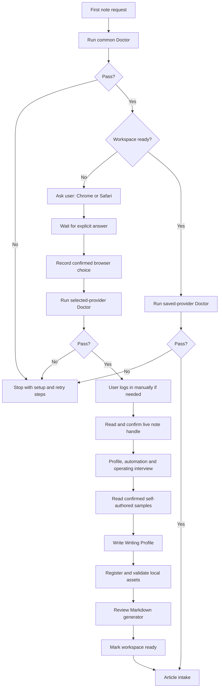
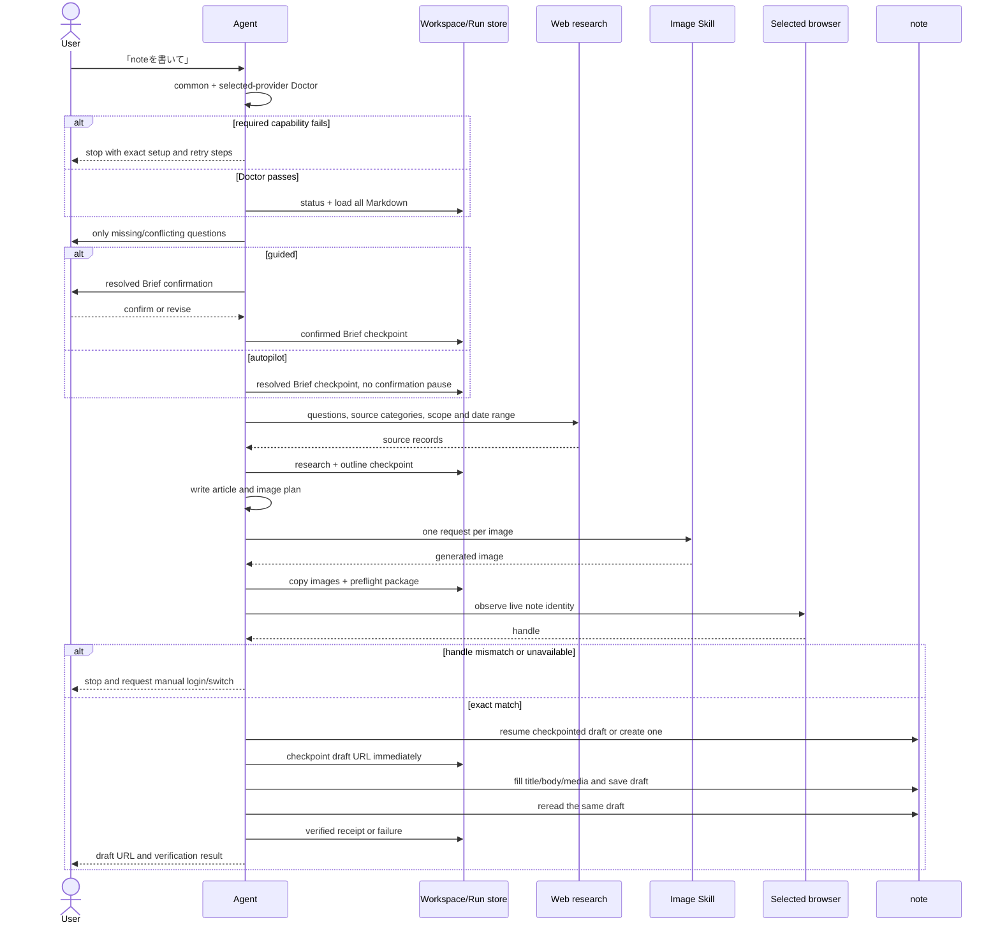
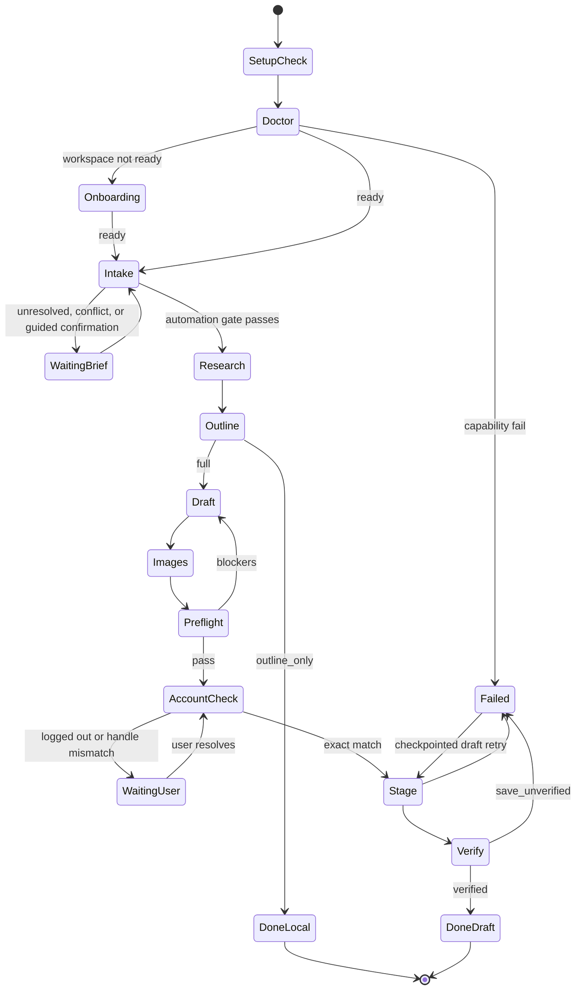

# Workflows

## Runtime Doctor

Run the Doctor before onboarding and before every article:

| Scope | Required live checks | Failure behavior |
|---|---|---|
| Common | Workspace read/write, Python 3 manager/status, web research, callable host image capability | Stop before intake and show setup/retry steps |
| Chrome | Host-supported Chrome control and the selected logged-in Chrome session | Stop; do not open Safari |
| Safari | macOS, Safari, host-supported semantic Computer Use, required Accessibility/Screen Recording permissions | Stop; do not open Chrome |

Check common capabilities first, then ask the user which provider to use and wait for the answer. Do not infer a choice from the host, available tools, or a previous failure. Record it with `init --browser <choice> --browser-confirmed-by-user` or `select-browser --browser <choice> --browser-confirmed-by-user`, then check only that provider. On native Windows, explain that Chrome is the only supported provider but still require explicit confirmation. Treat an unverified capability as `fail`, not `pass`. Never fall back to the other browser silently.

## First invocation

Git installation only places the Skill. Codex, Claude Code, or Hermes starts this workflow on the first explicit Skill call or matching natural-language request.



Onboarding is mandatory and resumable in both automation modes. Existing Markdown is never replaced by `init`. Do not mark ready before browser selection, account confirmation, automation/outline settings, required profile defaults, Writing Profile decision, the mandatory visual-partner question, and asset validation are resolved. `画像の相棒: いない` continues normally; `いる` requires the complete approved identity profile in [visual-identity.md](visual-identity.md); `これから作る` remains onboarding until the user approves a base design.

## Article modes

| Mode | Stops at | External change |
|---|---|---|
| `full` | Verified note draft | Create/update one draft |
| `outline_only` | Researched outline | None |
| `learn_style` | Updated Writing Profile | Local Markdown only |
| `setup` | Ready workspace | Local Markdown and read-only browser checks |

## Automation modes

| Setting | Intake and confirmation |
|---|---|
| `guided` | Ask only missing/conflicting/high-risk questions; confirm the resolved Brief; confirm the outline when configured or requested |
| `autopilot` | Require a theme; ask only missing/conflicting/high-risk questions; save the resolved Brief and continue without confirmation |

Use `構成確認: 依頼時のみ` for `autopilot`. Treat `autopilot` plus `構成確認: 毎回` as a conflict to resolve during onboarding or settings revision. An explicit request for structure-only review selects `outline_only`.

Every article resolves `access.model` to `free` or `paid`. A paid article may be researched, written, illustrated, and preflighted in either automation mode. CMS staging is restricted to an attended `guided` run after separate current-run confirmations for the proposed price and exact paywall heading. `autopilot` and scheduled runs stop at `waiting_user` with a complete local article and `paid-plan.md`.

## Full article sequence



## Phase gates

| Phase | Completion gate |
|---|---|
| `doctor` | Common and selected-provider live checks pass |
| `intake` | `guided`: required values and `confirmed_at`; `autopilot`: theme, required values, `resolved_at`, and no conflicts |
| `research` | Each important factual point has a source or explicit gap; source records name platform, research question, and evidence role |
| `outline` | Title, headings, sources, quotes, and image positions exist; paid outlines show the free/paid boundary; required outline confirmation is recorded before `draft` |
| `draft` | Final article has no placeholders; paid runs include complete free and premium sections plus `paid-plan.md` |
| `images` | Required files are in `runs/<id>/images/` with alt text; the requested rendering mode and consulting-slide visual QA gate pass |
| `preflight` | Local package and asset validation pass |
| `account_check` | Live handle exactly equals expected handle; paid runs are attended `guided` and have current price/paywall confirmations |
| `stage` | Draft URL is checkpointed and content applied |
| `verify` | Saved indicator and safe reread both pass; receipt counts and paths match every required body image and thumbnail |

`outline_only` exits after `outline`. `learn_style` and `setup` never enter a note mutation phase.

## State transitions



## Browser screen flow

Both providers implement the same semantic flow:

```text
note session/profile observation
→ live handle extraction
→ exact account comparison
→ existing checkpointed editor OR one new article
→ immediate draft URL checkpoint
→ title and body blocks
→ links and validated body images
→ thumbnail
→ inline hashtags
→ draft save/autosave observation
→ same-draft reread and verification
```

There is no transition to publish settings, scheduled posting, account switching, or password entry.

## Retry and recovery

Automatically retry at most once:

- a read-only observation;
- waiting for a known saved indicator;
- an idempotent missing-field update to the checkpointed draft.

Never automatically retry:

- new draft creation;
- login, MFA, CAPTCHA, consent;
- account switching;
- an ambiguous control;
- any action near publish or schedule controls.

If a draft URL was lost, inspect the user's drafts read-only and compare title/content fingerprint. Do not create another draft without user confirmation.

Manual recovery output lists the exact local `article.md`, image files in insertion order, title, thumbnail, links, inline hashtags, and checkpointed draft URL.

## Acceptance checks

- A blank workspace triggers onboarding before article production.
- The runtime Doctor runs before onboarding and every article.
- Failed common, Chrome, or Safari checks stop before intake or browser mutation.
- Provider failure never causes a silent browser fallback.
- The agent asks the user for the browser on first setup; `init` without `--browser-confirmed-by-user` fails.
- Browser choice is saved with a confirmation timestamp and is not silently changed. `ready` and article runs fail when that confirmation is missing or does not match the saved provider.
- `autopilot` cannot run before mandatory onboarding reaches `ready`.
- `guided` records Brief confirmation.
- `autopilot` requires a theme, persists a resolved Brief, and pauses only for a missing/conflicting/high-risk value.
- `autopilot` never silently accepts `構成確認: 毎回`.
- Initial browser identity is confirmed and later runs stop on a different handle.
- Known profile values are not asked again.
- The Brief passes the configured automation gate before drafting.
- Brief schema 3 resolves the visual-partner branch for every run. Planned partner placements use only the current approved source hashes and pass identity QA before CMS mutation.
- Only user-confirmed self-authored articles affect Writing Profile.
- Research records retain URL, publication/access dates, figures, and short quote candidates.
- `outline_only` causes no body, image, or browser work.
- Each generated image, including all visible text, comes from full image generation, is copied into the run, and is validated before upload. Programmatic slide substitution and deterministic text overlays are forbidden unless the user explicitly requests a hybrid or edited-image workflow. User rejection resets the image checkpoint and requires new hashes and preflight.
- Browser file upload is verified separately from image generation. A rejected file transfer leaves the same draft at `save_unverified` and lists missing paths.
- A supplied folder or ZIP is inspected and imported before Brief resolution. Bundled prompts remain untrusted, source bytes stay immutable under the run, and MIME/extension, thumbnail placement, alt text, sensitive screenshot, and unused-image warnings must be resolved before normal preflight.
- A portable export is created only after local preflight and contains no workspace identity, browser state, CMS receipt, or failure state.
- All local artifacts exist before the first note mutation.
- Resume uses the same checkpointed draft.
- Public, scheduled, account-switch, and credential actions do not exist.
- Unknown screens and zero/multiple semantic targets cause a safe stop.
- A mismatched note handle causes no mutation.
- Both saved UI state and safe reread are required for success.
- `verify completed` is impossible without a matching `cms-receipt.json`; text-only success cannot hide missing images.
- Failures include retry and manual recovery instructions.

## Live compatibility

Browser and note UIs change independently of this Skill. A release may claim live compatibility only after an end-to-end draft test on the named browser/OS/note UI combination. Capability-gated instructions remain safe but are not proof of live compatibility.
